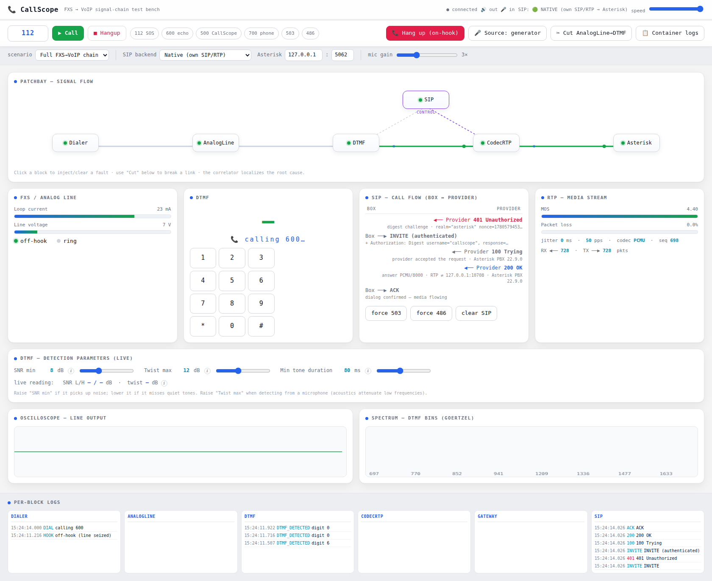

# CallScope

[](https://github.com/jakub-michalik/callScope/actions/workflows/ci.yml)
[](https://github.com/jakub-michalik/callScope/actions/workflows/docs.yml)
[](https://github.com/jakub-michalik/callScope/releases)
[](https://jakub-michalik.github.io/callScope/)


### 📖 [Read the documentation → jakub-michalik.github.io/callScope](https://jakub-michalik.github.io/callScope/)

**An oscilloscope for phone calls.** A live, in-browser test bench that walks a call
through the whole **FXS → VoIP** chain — analog dialer → FXS line → DTMF decode → SIP →
RTP/codec → gateway — visualizes every stage, lets you inject faults and cut links, and
**localizes the root cause** when a call breaks. It can run fully simulated, or become a
real SIP user agent and place actual calls against **Asterisk** with its own pure-Python
SIP + RTP stack (no external softphone).

> **The name** — *Call* (the telephone call) + *Scope* (oscilloscope). Just as a scope
> probes a circuit, CallScope probes the **whole call path**: you watch each stage light
> up, carry tones and packets, and fail — in real time, with the fault pinpointed to a block.

**What it demonstrates** (telecom / FXS→VoIP domain): DSP DTMF decoding (Goertzel),
SIP signaling + digest auth, RTP/G.711 media, a root-cause correlator over the signal
chain, and real interop with Asterisk — end to end, with live verification.

Docs: [**online API reference**](https://jakub-michalik.github.io/callScope/) · [`PLAN.md`](PLAN.md) · [`DESIGN.md`](DESIGN.md) · [`ASTERISK.md`](ASTERISK.md).

## Screenshots


*The full signal-chain dashboard: a two-plane **patchbay** (media row + SIP control plane),
per-block DSP panels (FXS line, DTMF keypad), live **SIP call-flow ladder**, **RTP** media
metrics, oscilloscope, DTMF **Goertzel spectrum**, and per-block event logs — all driven live
over a WebSocket. Header shows it connected in **native** mode to Asterisk.*



*A live call to Asterisk extension **600 (echo)**: the SIP ladder fills with the real
`INVITE → 401 → digest → 200 OK → ACK` exchange, the patchbay token flows, and the per-block
logs stream timestamped events.*

## This is real — it actually talks to Asterisk

In **native** mode CallScope *is* the SIP user agent: it opens its own UDP sockets and exchanges
**real SIP and RTP** with Asterisk on the wire — nothing about the live path is mocked. You can
prove every byte with a packet capture.

Real trace of `native → 600`, captured by [`tools/sip_trace.py`](tools/sip_trace.py) (it taps
the same stack the dashboard uses):

```
0.000s  TX ──►  INVITE                           SDP offer: m=audio 40008, PCMU/8000
0.001s  RX ◄──  401 Unauthorized                 WWW-Authenticate: Digest realm="asterisk", nonce=…
                                                  Server: Asterisk PBX 22.9.0
0.001s  TX ──►  ACK
0.001s  TX ──►  INVITE (+Authorization: Digest)  response=… (re-INVITE with computed digest)
0.001s  RX ◄──  100 Trying
0.004s  RX ◄──  200 OK                            SDP answer: Asterisk's RTP port, PCMU/8000
0.005s  TX ──►  ACK                              dialog confirmed — media flowing
        ── RTP ── G.711 µ-law, 50 pkt/s, two-way; echo returns from Asterisk (0% loss) ──
2.051s  TX ──►  BYE                              CallScope hangs up → Asterisk replies 200 OK
```

**Verify it yourself in Wireshark / tcpdump** — loopback, SIP on `5062`, RTP `10000–20000` (Asterisk) / `40000` (CallScope):

```bash
# live SIP in the console while you place a call
sudo tcpdump -i lo -n -A 'udp port 5062'

# capture SIP+RTP to a pcap, then open in Wireshark
sudo tcpdump -i lo -n -s0 'udp and (port 5062 or portrange 10000-20000 or portrange 40000-40010)' -w /tmp/callscope.pcap
wireshark /tmp/callscope.pcap
```
In Wireshark, **Telephony ▸ VoIP Calls ▸ Flow Sequence** shows the exact same ladder as the
dashboard — straight off the wire — and **RTP ▸ Play Streams** plays back the echoed audio.

> In `sim` mode there are **no packets** on the network: the ladder is generated in-process for
> an infrastructure-free demo. The wire-level proof above needs `native` (or `live`).

## Status — Phases 0–5 (done)

**Phase 0 — graph skeleton:** block/patch contract, event bus, WebSocket, the patchbay
dashboard on synthetic events.

Live flow through 3 blocks **Dialer → AnalogLine/FXS → DTMF** with real DSP:
- DTMF synthesis + **Goertzel** decoder (8 frequencies) with validation (level, twist,
  dominance, anti-speech, timing),
- electrical model of the line (loop current, voltage, off-hook),
- detections: `DTMF_DETECTED/TOO_SHORT/TWIST_OOR/REJECTED`, `FXS_NO_LOOP_CURRENT`,
  `LINE_LOW_SNR`, `SIGNAL_CUT`,
- in-browser dashboard: patchbay with an animated flow token, oscilloscope,
  DTMF spectrum, keypad, FXS gauges, event log; **fault/cut** live.

**Phase 1 — real audio** (`sounddevice`): the generated tone goes out to the **speaker**;
the **microphone** acts as a swappable source for the chain (gen/mic switch in the UI) — play a tone into
the microphone, and Goertzel decodes it live. Falls back to the generator when no audio device is present.
Hardware check: `python -m audio.selftest` (from the `backend/` directory).

**Phase 2 — fault injection + root-cause correlator**: click any block to inject a
fault (weak tone, no loop current, line noise, 50 Hz hum) or cut a link; the
**correlator** localizes the most-upstream cause across stages and shows a root-cause
banner with downstream consequences. Repeated diagnostics collapse in the event log.

**Phase 3 — VoIP leg (SIP + RTP)**: the chain extends to
`Dialer → AnalogLine → DTMF → CodecRTP → Gateway`, with a SIP control-plane state
machine (INVITE → 100 → 180 → 200 OK → ACK → BYE) rendered as a live call-flow ladder
with real response codes, and an RTP media panel (loss %, jitter, MOS, codec, seq).
New faults: SIP `503`/`486`, RTP `packet_loss`/`jitter`; the correlator gains a
one-way-audio rule (signaling up but media not reaching the gateway).

**Phase 4 — versatility + live SIP**: the chain is **config-driven** (`scenarios/*.json`, switchable
in the UI); blocks declare their own conditions/faults so adding one touches a single place;
the patchbay topology is sent by the backend. Default stays fully simulated.

**Phase 5 — native SIP/RTP stack (no external client)**: in
`CALLSCOPE_SIP_MODE=native`, CallScope *is* the SIP user agent — a pure-Python UAC in
[`backend/voip/`](backend/voip/) that opens its own UDP sockets, builds INVITE/ACK/BYE,
answers **digest** challenges (RFC 2617), negotiates RTP via SDP, and streams **G.711** RTP.
No `baresip`/`pjsua`/`linphone` dependency. See [`ASTERISK.md`](ASTERISK.md) for the full setup.

### Three SIP backends — and why

The SIP control plane is pluggable: all three backends expose the same interface
(`start/tick/hangup/state/conditions/rtp_stats`), so the dashboard, fault injection and the
root-cause correlator work identically on top of any of them. Pick one live from the
**SIP backend** dropdown in the Controls card (or set `CALLSCOPE_SIP_MODE` at launch). They
exist because each answers a different question:

| Backend | `CALLSCOPE_SIP_MODE` | What it is | Why it exists |
|---|---|---|---|
| **Simulated** | `sim` (default) | The SIP ladder (INVITE→100→180→200→ACK→BYE) and response codes are produced **in-process** — no sockets, no network. | Runs the whole demo **anywhere with zero dependencies** (no Docker, no Asterisk). It's the safe default for development, CI and showing the DSP/fault/correlator story without infrastructure. |
| **Native** | `native` | CallScope is the SIP UA itself: own UDP sockets, INVITE/ACK/BYE, **digest** auth, SDP, **G.711 RTP** — pure Python ([`backend/voip/`](backend/voip/)). | Proves the hard part — *"I handle SIP and RTP myself"* — against a real Asterisk, with no third-party client to hide behind. **Recommended** live mode; verified end-to-end (table below). |
| **baresip (live)** | `live` | Drives an external **baresip** client over its `ctrl_tcp` interface ([`backend/sip_adapter.py`](backend/sip_adapter.py)). | An **interop cross-check**: it shows the same Asterisk endpoint also works with an off-the-shelf client, which independently confirms the server config is right (not just my code). Best-effort — needs `baresip` installed and has its own setup caveats (below). |

Switching is hot: selecting a backend tears down the current one (ends the call, releases
sockets/subprocess), rebuilds the chain on the new one, and the header tag shows the effective
mode. If a live backend can't bind or reach Asterisk it **falls back to `sim`** and shows the
error, so the dashboard never dies on a bad pick.

### Live with Asterisk — verified, and the lessons learned

Run against a real **Asterisk** (Docker), the native stack drives real calls end-to-end:

| Dial | Asterisk | Result (observed) |
|---|---|---|
| **600** | `Echo()` | `INVITE → 200 → ACK` → **INCALL**; RTP negotiated from SDP, echo packets received, real jitter on the panel; clean `BYE` → TERMINATED |
| **503** | `Congestion()` | `INVITE → 503` → **FAILED**, `SIP_503` root cause |

Two non-obvious traps cost real debugging time and are worth recording:

1. **A host SIP service on port 5060 silently steals all traffic.** If a system Asterisk
   (`systemctl is-active asterisk`) already owns `0.0.0.0:5060`, a `network_mode: host`
   container **cannot bind 5060** — every INVITE/REGISTER hits the *host* service with *its*
   config (no `callscope` endpoint → challenges and rejects everything). It looks exactly like
   "digest auth is broken," but the `Server:` header in the 401 gives it away (a different
   Asterisk version than your container). **Fix:** the bundled container binds **5062**
   (`conf/pjsip.conf` → `transport-udp`), so host `5060` and container `5062` coexist; point
   CallScope with `CALLSCOPE_SIP_PORT=5062`. The digest implementation was correct the whole
   time — proven independently by [`tests/test_sip_native.py`](tests/test_sip_native.py)
   (full call against a reference UAS) and the RFC 2617 vector in
   [`tests/test_voip.py`](tests/test_voip.py).
2. **Single-file Docker bind-mounts are inode-pinned.** Editing `conf/pjsip.conf` on the host
   leaves the container reading the *old* file until `docker compose restart` — a plain
   `pjsip reload` won't see the change. This masked every config edit until the restart.

**Cross-check with baresip.** As an independent sanity check that the endpoint (not the code)
was always fine, `baresip` 1.0.0 was pointed at the same container and registered cleanly:
`callscope@127.0.0.1 … 200 OK (Asterisk PBX 22.9.0) [1 binding]`. So both the native UAC *and*
an off-the-shelf client authenticate against this Asterisk — the original failures were purely
the port-5060 collision. baresip 1.0.0 adds two of its own config gotchas, independent of
Asterisk: it must load a **codec module** (`g711.so`) or it reports `Populated 0 audio codecs`
and silently won't register, and the account must target the registrar **port** explicitly or
it defaults to 5060 (the wrong server). The `live` adapter now bakes in both
([`backend/sip_adapter.py`](backend/sip_adapter.py): loads `g711.so`, writes the port into the
account URI), so it can drive this container — but it still needs `baresip` on the host and a
working `ctrl_tcp`, so native remains the recommended path.

Upcoming phases (DESIGN §7, §13): replay/export.

## Running (PC)

```bash
python3 -m venv .venv && . .venv/bin/activate
pip install -r requirements.txt
python backend/run.py            # → http://localhost:8000
```

In the dashboard: **Start Notruf (112)** plays back the number dialing — the token flows through
the chain, the spectrum lights up bins, and the digits are decoded. **Cut AnalogLine→DTMF** cuts the
signal (the token stops, no detection). The "tempo" slider slows the simulation down so you can watch it.

## Tests

```bash
. .venv/bin/activate
python -m pytest -q                 # 80 tests: DTMF vectors, blocks, chain, correlator,
                                    #   scenarios, SIP, digest (RFC 2617), RTP/G.711, native UAC
python -m pytest tests/test_dtmf.py -q
python -m pytest tests/test_sip_native.py -q   # native UAC: full call vs a reference UAS
```

## Structure

```
backend/
  engine/  const, frame, block, patch, faults, bus, graph
  dsp/     tone_gen, goertzel, metrics
  blocks/  dialer, analog_line, dtmf, codec_rtp, gateway, sip
  voip/    digest (RFC 2617), rtp (RFC 3550 + G.711), sip_native (native UAC + RTP)
  diag/    correlator
  app/     main (FastAPI + WS), run.py
  sip_adapter.py   legacy baresip→Asterisk adapter (CALLSCOPE_SIP_MODE=live)
frontend/  index.html  (dashboard: patchbay, scope, DTMF, SIP ladder, RTP panel)
scenarios/ full_chain, analog_only  (config-driven chains)
asterisk/  docker-compose + conf (pjsip/extensions/manager) for live SIP
tests/     dtmf, analog_line, dialer, chain, correlator, scenario, contract,
           codec_rtp, sip, sip_adapter, voip, test_sip_native, regression
```
