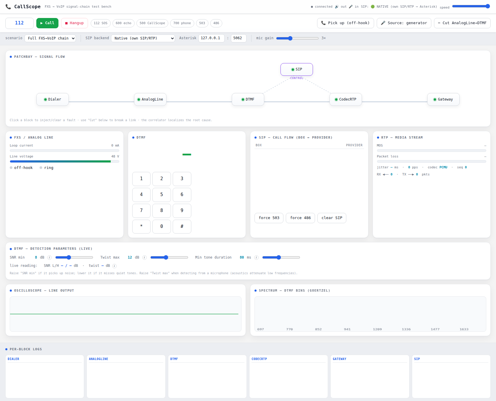

CallScope
=========

.. |ci| image:: https://github.com/jakub-michalik/callScope/actions/workflows/ci.yml/badge.svg
   :target: https://github.com/jakub-michalik/callScope/actions/workflows/ci.yml
   :alt: CI
.. |docs| image:: https://github.com/jakub-michalik/callScope/actions/workflows/docs.yml/badge.svg
   :target: https://github.com/jakub-michalik/callScope/actions/workflows/docs.yml
   :alt: Docs
.. |release| image:: https://img.shields.io/github/v/release/jakub-michalik/callScope?display_name=tag&sort=semver
   :target: https://github.com/jakub-michalik/callScope/releases
   :alt: Release
.. |license| image:: https://img.shields.io/badge/license-MIT-green
   :target: https://github.com/jakub-michalik/callScope/blob/main/LICENSE
   :alt: License: MIT

.. rst-class:: badges

|ci| |docs| |release| |license|

📦 **Repository:** `github.com/jakub-michalik/callScope <https://github.com/jakub-michalik/callScope>`_

**An oscilloscope for phone calls.** A live, in-browser test bench that walks a call
through the whole **FXS → VoIP** chain — analog dialer → FXS line → DTMF decode → SIP →
RTP/codec → gateway — visualizes every stage, lets you inject faults and cut links, and
**localizes the root cause** when a call breaks. It runs fully simulated, or becomes a real
SIP user agent that places actual calls against **Asterisk** with its own pure-Python
SIP + RTP stack (no external softphone).

This site documents the internals: the block-graph engine, the DSP and protocol
primitives (Goertzel DTMF, SIP digest, RTP/G.711), the signal-chain blocks, and the
root-cause correlator.

.. toctree::
   :caption: Getting started
   :maxdepth: 2

   quickstart

.. toctree::
   :caption: Architecture
   :maxdepth: 2

   overview
   architecture
   screenshots

.. toctree::
   :caption: Guides
   :maxdepth: 2

   troubleshooting
   changelog

.. toctree::
   :caption: Reference
   :maxdepth: 2

   api

Indices
-------

* :ref:`genindex`
* :ref:`modindex`
